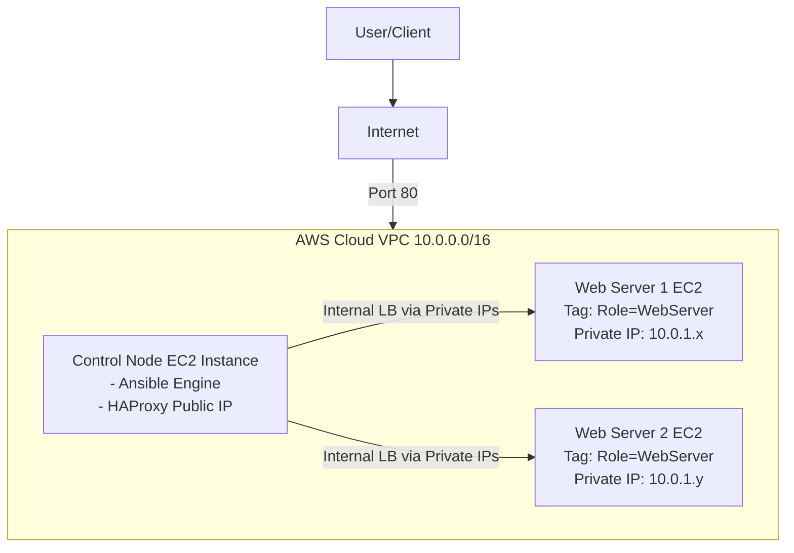

# Automated HAProxy Configuration with Ansible Dynamic Inventory on AWS


### Project Report | September 2025

---

## 1. Overview

This project demonstrates a fully automated, cloud-native solution for managing a high-availability web service architecture. It features an HAProxy load balancer that dynamically discovers and configures its backend server pool using Ansible's dynamic inventory capabilities for AWS. The system is designed to automatically adapt to changes in the infrastructure—such as the addition or removal of web servers—without any manual intervention, ensuring continuous service availability and scalability.

## 2. Core Problem Solved

In dynamic cloud environments, manually updating a load balancer's configuration every time a web server is launched or terminated is inefficient, slow, and highly prone to human error. This can lead to service downtime, as traffic might be sent to non-existent servers or new servers might not receive any traffic at all. This project automates that entire process, creating a self-managing and resilient system.

## 3. Architecture Diagram

## 4. How It Works: The Automation Workflow

1.  **Tag-Based Discovery:** Web server EC2 instances are launched with a specific tag (e.g., `Role: WebServer`).
2.  **Dynamic Inventory Query:** An Ansible playbook is run on the control node. It uses the `aws_ec2` dynamic inventory plugin, which queries the AWS API in real-time for all instances matching the `Role:WebServer` tag.
3.  **Live Inventory Generation:** The plugin returns a fresh, up-to-the-minute list of the private IP addresses of all matching web servers.
4.  **Configuration Templating:** This dynamic list is fed as a variable into a Jinja2 template (`haproxy.cfg.j2`), which serves as a blueprint for the HAProxy configuration file.
5.  **Idempotent Deployment:** Ansible generates a new `haproxy.cfg` file. If no servers have changed since the last run, the file remains identical, and no action is taken.
6.  **Graceful Reload:** If the configuration file *has* changed, a handler is triggered to gracefully reload the HAProxy service, applying the new configuration without dropping any active user connections.
7.  **Web Page Deployment:** A second playbook ensures all discovered web servers have a consistent, template-driven `index.html` page.

## 5. Core Technologies Utilized

* **Cloud Platform:** Amazon Web Services (AWS)
* **Automation Engine:** Ansible
* **Load Balancer:** HAProxy
* **Templating Engine:** Jinja2
* **Infrastructure:** AWS EC2, VPC, Subnets, Security Groups, IAM Roles
* **Operating System:** Ubuntu 24.04 LTS

## 6. Key Concepts Demonstrated

* **Infrastructure as Code (IaC):** All configuration is defined in code (YAML playbooks, Jinja2 templates), making it versionable and repeatable.
* **Dynamic Inventory:** Eliminates static host files, allowing for a fluid and automated discovery of infrastructure.
* **Idempotency:** Ansible playbooks can be run multiple times without causing unintended side effects, ensuring a consistent state.
* **Configuration Management:** Using templates and handlers to maintain application state and ensure service stability during updates.

## 7. Repository Structure
```text
.
├── ansible.cfg                 # Ansible project configuration (sets defaults, disables host key checking)
├── aws_ec2.yml                 # Dynamic inventory source file for the aws_ec2 plugin
├── deploy_webpage.yml          # Playbook to deploy the test webpage to all web servers
├── haproxy_playbook.yml        # Playbook to configure and reload HAProxy on the control node
├── haproxy.cfg.j2              # Jinja2 template for the HAProxy configuration
├── index.html.j2               # Jinja2 template for the test webpage
└── .gitignore                  # Instructs Git to ignore sensitive files like private keys
```
## 8. Getting Started: Setup Guide

This section provides a high-level overview of the steps required to deploy this project.

**➡️ For a complete, detailed walkthrough with specific values and commands, please follow the [SETUP_GUIDE.md](SETUP_GUIDE.md) file in this repository.**

The setup process follows five main phases:

1.  **Build the AWS Network Foundation:**
    Create a custom VPC, a public subnet, an Internet Gateway, route tables, and a security group that allows HTTP and SSH traffic. This creates the secure, isolated environment for our instances.

2.  **Provision EC2 Instances:**
    Launch one EC2 instance to act as the Ansible Control Node and HAProxy server. Then, launch at least two other EC2 instances to act as web servers, ensuring they are tagged with `Role: WebServer`.

3.  **Configure the Control Node:**
    This step involves connecting to the control node via SSH, installing the required software (Ansible, Git, HAProxy), and securely placing the SSH private key on the node so that it can manage the other web server instances. An IAM Role with `AmazonEC2ReadOnlyAccess` must also be attached to this instance.

4.  **Deploy the Ansible Project:**
    SSH into your control node, then clone the project files from this repository.
    ```bash
    git clone [https://github.com/githubabhay2003/ansible-dynamic-inventory-project.git](https://github.com/githubabhay2003/ansible-dynamic-inventory-project.git)
    cd ansible-dynamic-inventory-project
    ```
    The only required change is to edit the `aws_ec2.yml` file to specify your correct AWS region.

5.  **Run the Automation and Verify:**
    From the project directory on the control node, execute the Ansible playbooks to configure the web servers and the HAProxy load balancer.
    ```bash
    # First, deploy the webpages to the backend servers
    ansible-playbook deploy_webpage.yml

    # Second, configure HAProxy to use the discovered servers
    ansible-playbook haproxy_playbook.yml
    ```
    Finally, you can verify the entire system is working by sending requests to the load balancer from your local machine:
    ```bash
    # Test the load balancer from your local terminal
    curl http://<control-node-public-ip>
    ```
# 9. Challenges Faced & Solutions

During the development of this project, several real-world issues were encountered. This section documents the troubleshooting process and the solutions implemented.

## Challenge 1: Unreliable Web Page Content

**Problem:**  
The initial approach used an EC2 "User Data" script to install Apache and create a unique `index.html` file. However, the resulting web pages were inconsistent; sometimes the Instance ID and IP address would not appear. This was likely due to a race condition where the script ran before the instance's network was fully ready to query the AWS metadata service.

**Solution:**  
We implemented a more robust, centralized solution using Ansible. A new playbook (`deploy_webpage.yml`) and template (`index.html.j2`) were created. This playbook uses Ansible "facts" (e.g., `ansible_hostname`, `ansible_default_ipv4.address`)—which are reliably gathered after the server is fully booted—to create a unique and correct `index.html` file on every web server. This ensures consistency and is a better Infrastructure as Code practice.

## Challenge 2: Ansible SSH Connection Errors

**Problem:**  
The first attempt to run a playbook from the control node to the remote web servers failed with two errors: `Permission denied (publickey)` and `Host key verification failed`.

**Analysis:**  
This revealed two issues:

- The Ansible control node did not possess the SSH private key required to authenticate with the other servers.  
- Ansible could not interact with the SSH security prompt that asks whether to trust a new host's fingerprint.

**Solution:**  
Both issues were resolved by creating a project-specific Ansible configuration file (`ansible.cfg`):

1. The `.pem` private key was securely copied from the local machine to the `~/.ssh/` directory on the control node with strict permissions (`chmod 400`).  
2. The `ansible.cfg` file was configured with `private_key_file = ~/.ssh/project_key.pem` to tell Ansible where to find the key for authentication.  
3. The directive `host_key_checking = False` was added to `ansible.cfg` to automatically trust the fingerprints of new instances within our secure VPC, resolving the interactive prompt issue.

## Challenge 3: Load Balancing Not Visibly Working

**Problem:**  
After the configuration appeared correct and HAProxy was running, browser tests still seemed to hit only one server.

**Solution:**  
A systematic debugging process was followed to isolate the root cause:

1. **Verify Discovery:** Ran `ansible-inventory --graph` to confirm that Ansible could see all backend servers. (It could).  
2. **Verify Configuration:** Inspected the generated `/etc/haproxy/haproxy.cfg` file on the control node to confirm all server IPs were present. (They were).  
3. **Verify Connectivity:** Used `curl` from the control node to the private IP of each web server to confirm the network path and security group rules were correct. (They were).  
4. **Verify Service State:** Used the HAProxy admin socket (`echo "show stat" | sudo socat ...`) to inspect the internal state of the running service. This definitively proved that HAProxy saw all backend servers as UP and healthy.

**Conclusion:**  
This process proved that the server-side infrastructure was perfect. The issue was isolated to a combination of aggressive browser caching and the fact that both backend servers were initially serving identical-looking pages (see Challenge 1). The final fix was to use the Ansible-generated unique pages and test with a cache-bypassing tool like `curl` in a loop.

# 10. Key Points & Best Practices

For anyone replicating or building upon this project, keep these key principles in mind:

## Tagging Discipline is Crucial
The entire automation hinges on the exact `Role: WebServer` tag. A typo will cause a server to be completely ignored. Keep your tagging strategy consistent.

## IAM Roles are Superior for EC2
Using an IAM Role to grant the control node permissions to the AWS API is the most secure method. It avoids hard-coding secret keys and automatically manages credential rotation.

## Security Groups are Your Primary Firewall
Remember to configure rules for both external traffic (from the internet) and internal traffic (between instances). A common mistake is forgetting to allow the load balancer to talk to the web servers on their private IPs.

## The Control Node is an SSH Client
The Ansible control node needs the same things a user would to connect to other machines: a private key for authentication and a way to handle host key verification. Using `ansible.cfg` is the standard way to manage this.

## Embrace Idempotency
The fact that you can re-run the playbooks safely without causing unnecessary changes is a core feature of Ansible that leads to stable and predictable systems.

## Debug Systematically
When troubleshooting, don't guess. Follow the flow of data and verify each step in the chain:  

1. **Discovery:** `ansible-inventory`  
2. **Configuration:** `cat *.cfg`  
3. **Service State:** `systemctl status`, admin socket  
4. **Network Connectivity:** `curl`, `ping`  
5. **Client:** `curl`, browser

### ► Contributing
Contributions are welcome! If you have suggestions for improvements, please feel free to open an issue or submit a pull request.

---

### ► License
This project is licensed under the MIT License. See the [LICENSE](LICENSE) file for details.

---

### ► Author & Contact

-   **Abhay Kumar Saini**
-   **GitHub:** <a href="https://github.com/githubabhay2003" target="_blank">githubabhay2003</a>
-   **LinkedIn:** <a href="https://www.linkedin.com/in/abhay-kumar-saini-571891264/" target="_blank">Abhay Kumar Saini</a>

