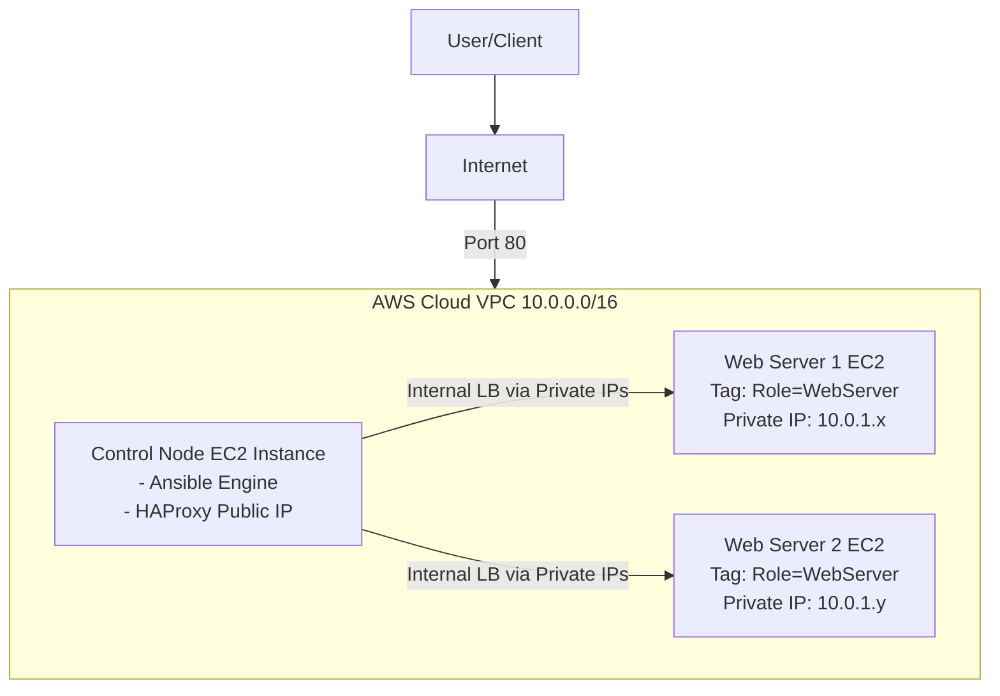

# Automated HAProxy Configuration with Ansible Dynamic Inventory on AWS


### Project Report | September 2025

---

## 1. Overview

This project demonstrates a fully automated, cloud-native solution for managing a high-availability web service architecture. It features an HAProxy load balancer that dynamically discovers and configures its backend server pool using Ansible's dynamic inventory capabilities for AWS. The system is designed to automatically adapt to changes in the infrastructure—such as the addition or removal of web servers—without any manual intervention, ensuring continuous service availability and scalability.

## 2. Core Problem Solved

In dynamic cloud environments, manually updating a load balancer's configuration every time a web server is launched or terminated is inefficient, slow, and highly prone to human error. This can lead to service downtime, as traffic might be sent to non-existent servers or new servers might not receive any traffic at all. This project automates that entire process, creating a self-managing and resilient system.

## 3. Architecture Diagram

## 4. How It Works: The Automation Workflow

1.  **Tag-Based Discovery:** Web server EC2 instances are launched with a specific tag (e.g., `Role: WebServer`).
2.  **Dynamic Inventory Query:** An Ansible playbook is run on the control node. It uses the `aws_ec2` dynamic inventory plugin, which queries the AWS API in real-time for all instances matching the `Role:WebServer` tag.
3.  **Live Inventory Generation:** The plugin returns a fresh, up-to-the-minute list of the private IP addresses of all matching web servers.
4.  **Configuration Templating:** This dynamic list is fed as a variable into a Jinja2 template (`haproxy.cfg.j2`), which serves as a blueprint for the HAProxy configuration file.
5.  **Idempotent Deployment:** Ansible generates a new `haproxy.cfg` file. If no servers have changed since the last run, the file remains identical, and no action is taken.
6.  **Graceful Reload:** If the configuration file *has* changed, a handler is triggered to gracefully reload the HAProxy service, applying the new configuration without dropping any active user connections.
7.  **Web Page Deployment:** A second playbook ensures all discovered web servers have a consistent, template-driven `index.html` page.

## 5. Core Technologies Utilized

* **Cloud Platform:** Amazon Web Services (AWS)
* **Automation Engine:** Ansible
* **Load Balancer:** HAProxy
* **Templating Engine:** Jinja2
* **Infrastructure:** AWS EC2, VPC, Subnets, Security Groups, IAM Roles
* **Operating System:** Ubuntu 24.04 LTS

## 6. Key Concepts Demonstrated

* **Infrastructure as Code (IaC):** All configuration is defined in code (YAML playbooks, Jinja2 templates), making it versionable and repeatable.
* **Dynamic Inventory:** Eliminates static host files, allowing for a fluid and automated discovery of infrastructure.
* **Idempotency:** Ansible playbooks can be run multiple times without causing unintended side effects, ensuring a consistent state.
* **Configuration Management:** Using templates and handlers to maintain application state and ensure service stability during updates.

## 7. Repository Structure
```text
.
├── ansible.cfg                 # Ansible project configuration (sets defaults, disables host key checking)
├── aws_ec2.yml                 # Dynamic inventory source file for the aws_ec2 plugin
├── deploy_webpage.yml          # Playbook to deploy the test webpage to all web servers
├── haproxy_playbook.yml        # Playbook to configure and reload HAProxy on the control node
├── haproxy.cfg.j2              # Jinja2 template for the HAProxy configuration
├── index.html.j2               # Jinja2 template for the test webpage
└── .gitignore                  # Instructs Git to ignore sensitive files like private keys
```
## 8. Getting Started: Setup Guide

This section provides a high-level overview of the steps required to deploy this project from scratch.

**➡️ For a complete, detailed walkthrough with specific values and commands, please follow the [SETUP_GUIDE.pdf](SETUP_GUIDE.pdf) file in this repository.**

The setup process follows five main phases:

1.  **Build the AWS Network Foundation:**
    This involves creating a custom VPC, a public subnet, an Internet Gateway, route tables, and a security group. This creates the secure and isolated network environment for all our instances.

2.  **Provision EC2 Instances:**
    You will launch one EC2 instance to act as the Ansible Control Node and HAProxy server. Then, you will launch at least two other EC2 instances to act as web servers, ensuring they are tagged correctly with `Role: WebServer`.

3.  **Configure the Control Node:**
    This step involves connecting to the control node via SSH, installing the required software (Ansible, HAProxy), and securely placing the SSH private key on the node so that it can manage the other web server instances. An IAM Role with read-only EC2 permissions must also be attached to this instance.

4.  **Deploy the Ansible Project:**
    You will clone this repository onto the control node. The only required change is to edit the `aws_ec2.yml` file to specify your correct AWS region.

5.  **Run the Automation and Verify:**
    From the project directory on the control node, you will execute the Ansible playbooks to configure the web servers and the HAProxy load balancer.
    ```bash
    # First, deploy the webpages to the backend servers
    ansible-playbook deploy_webpage.yml

    # Second, configure HAProxy to use the discovered servers
    ansible-playbook haproxy_playbook.yml
    ```
    Finally, you can verify the entire system is working by sending requests to the load balancer from your local machine:
    ```bash
    # Test the load balancer from your local terminal
    curl http://<control-node-public-ip>
    ```

